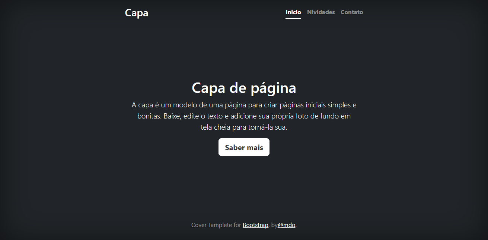

# Índice

[Projeto - Aprendendo a escrever um README](#projeto---aprendendo-a-escrever-um-readme)

[Descrição](#descri%C3%A7%C3%A3o)

[Introdução](#introdu%C3%A7%C3%A3o)

[Funcionalidades](#funcionalidades)

[Tecnologias utilizadas](#tecnologias-utilizadas)

[Fontes cosultadas](#fontes-cosultadas)

[Autores](#autores)

# Projeto - Aprendendo a escrever um README

## Descrição

[Descriçoes É uma pagina incial com os botões de novidades e contatos](#descri%C3%A7%C3%A3o)

## Introdução

[Este projeto é uma página de capa  usando Bootstrap v5.0, ideal para página inicial, com cabeçalho, seção principal e rodapé](#introdu%C3%A7%C3%A3o)

## Funcionalidades

[* Cabeçalho com links de navegação.](#funcionalidades)

[* Botão "Saber mais" na pagina principal.](#funcionalidades)

[* Estilização usando CSS.](#funcionalidades)

[* Layout do Bootstrap.](#funcionalidades)

### Tecnologias utilizadas

[*HTML5](#tecnologias-utilizadas)

[*CSS3](#tecnologias-utilizadas)

[*Bootstrap v5.0](#tecnologias-utilizadas)

## Fontes cosultadas

[https://getbootstrap.com/](#fontes-cosultadas)

## Autores

[Nicolas, Miguel e Gabriel](#autores)